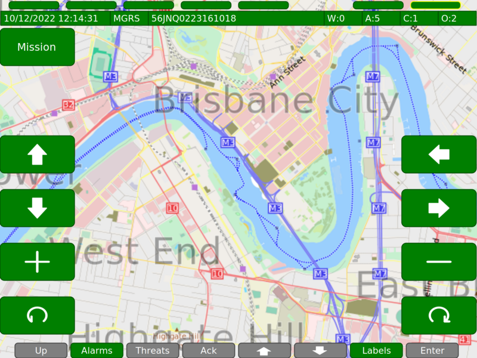

[](https://sonarcloud.io/summary/new_code?id=DefenceX_vivoe-lite)
[](https://sonarcloud.io/summary/new_code?id=DefenceX_vivoe-lite)
[](https://sonarcloud.io/summary/new_code?id=DefenceX_vivoe-lite)
[](https://sonarcloud.io/summary/new_code?id=DefenceX_vivoe-lite)
[](https://sonarcloud.io/summary/new_code?id=DefenceX_vivoe-lite)
[](https://sonarcloud.io/summary/new_code?id=DefenceX_vivoe-lite)

[](https://github.com/DefenceX/vivoe-lite/actions/workflows/build-ubuntu-amd64-cyclone.yaml)
[](https://github.com/DefenceX/vivoe-lite/actions/workflows/build-centos-amd64-cyclone.yaml)
[](https://github.com/DefenceX/vivoe-lite/actions/workflows/build-debian-arm64-cyclone.yaml)
[](https://github.com/DefenceX/vivoe-lite/actions/workflows/build-msys2-amd64-cyclone.yaml)
[](https://github.com/ross-newman/vivoe-lite/actions/workflows/build-doxygen.yaml)


[](https://bestpractices.coreinfrastructure.org/projects/2927)
[](https://opensource.org/licenses/MIT)


# vivoe-lite


**A Generic Vehicle Architecture HMI (Human Machine Interface)**

# Dependencies
This VIVOE (Vetronics Infrastructure for Video Over Ethernet) environment is currently tested on Ubuntu 22.04 LTS. To install required packages review and run [scripts/init_build_machine_ubuntu.sh](scripts/init_build_machine_ubuntu.sh). 

For msys2 under Windows 11 run [scripts/init_build_machine_msys2.sh](scripts/init_build_machine_msys2.sh)

For CentOS Stream 8 run [scripts/init_build_machine_centos.sh](scripts/init_build_machine_centos.sh)

# Documentation
Documentation can be generated using doxygen after cloning or see latest documentation on [Github Pages](https://defencex.github.io/vivoe-lite/).


# Build
This project has a couple of options that can be specified at compile time:
```
cmake -DCMAKE_BUILD_TYPE=Debug -DENABLE_COVERAGE=ON -DENABLE_OSMSCOUT=ON -DDDS=CYCLONE-CE ..
```

## Building for Windows using MSYS
```
cmake -G "MSYS Makefiles" ..
```

## Libraries
Table below is a summary of the libraries used in this project:

| External library      | Source                                                         | Version     | Date       |
| ----------------------|----------------------------------------------------------------|-------------|------------|
| CycloneDDS (opt)      | https://github.com/eclipse-cyclonedds/cyclonedds               | 0.10.2      | 26/08/2022 |
| OpenSplice (opt)      | https://github.com/ADLINK-IST/opensplice                       | v6.9.210323 | 23/05/2021 |
| cairo                 | https://github.com/freedesktop/cairo                           | 2           | latest     |
| doxygen               | https://www.doxygen.nl/                                        | -           | latest     |
| geographiclib         | https://github.com/geographiclib/geographiclib                 | v2.1.2      | 14/12/2022 |
| gflag                 | https://github.com/gflags/gflags                               | v2.2.2      | 12/11/2018 |
| glog                  | https://github.com/google/glog                                 | v0.6.0      | 05/04/2022 |
| libosmscout           | https://github.com/Framstag/libosmscout                        | 1.1.0       | 22/11/2018 |
| lttng-ust             | https://github.com/lttng/lttng-ust                             | v2.13.5     | 01/10/2022 |
| vivoe-media-framework | https://github.com/DefenceX/vivoe-media-framework              | v0.4.299    | 12/02/2023 |
| nmea                  | https://nmea.sourceforge.net/                                  | 0.5.3       | 11/03/2008 |
| pango                 | https://github.com/GNOME/pango                                 | 1.50.12     | 19/11/2022 |
| protobuf              | https://github.com/protocolbuffers/protobuf                    | v21.12      | 13/12/2022 |

Default DDS stack is currently [CycloneDDS](https://github.com/eclipse-cyclonedds/cyclonedds) (default if not specified) but can also be built with [Opensplice](https://github.com/ADLINK-IST/opensplice) by setting -DDDS=OSPL-CE. 

To enable code coverage reports set ENABLE_COVERAGE. The gdb debugger is avaiable and configured for use with Microsoft Visual Code and the workspace files are part of the repo (recommended for developers).

The BMS function can be configured with Open Street Maps but these need to be compiled and installed onto the system. Its recommended that you run wit these switched off if you do not need this functionality. See below for more information on creating maps for your region / territory.

# HMI
The project includes an reference implementation of the GVA (Generic Vehicle Architecture) like Human Machine Interface (HMI). This is meant as a designed for testing different live video sources and working with streaming protocols and does not implement functionality defined in the GVA Land Data Model (LDM). Its primarily used to demonstrate various video streaming pipelines and control mechanisms for real time video processing. Virtual HMI can be used for research and development and experimentation with different HMI elements for human factors and sensor integration, test, monitoring and detection of system wide events.


**APC Technology, military display**
<br>

Don't have deep pockets and need a cheep alternative then the ARM (Raspberry Pi CM4) could be a cost effective solution. GVA in your pocket.


**Seeed reTerminal**
<br>


> NOTE: Not all labels are currently implemented, project in heavy development! See [DEVELOPER.md](info/DEVELOPER.md) for issues and features.

Video can be streamed to an optional video processing unit (GPU/TPU for AI/ML and hemispherical video processing) before being received by the HMI processor for video overlays and personalisation for gunner/commander and driver displays. Multicast vdeo streams should be received by all consumers in realtime (networking not shown). There may be one or more users and displays on any given manned vehicle.


Touch screen inputs and bezel key inputs are sent back to the HMI to update the overlays in the RTP stream. The display can be 'dumb' with HMI / Video processing being done on a separate LRU. RTP streams being received by the display have the overlays already rendered in the video stream.

### HMI Controls

To build the HMI clone the code and run cmake. Automated builds are handled by Github Actions

The following keys can be used to interact with the display:
* <kbd>+</kbd> Rotate PPI clockwise
* <kbd>-</kbd> Rotate PPI anti-clockwise
* <kbd>></kbd> Rotate Sight anti-clockwise
* <kbd><</kbd> Rotate Sight anti-clockwise
* <kbd>F1</kbd> - <kbd>F12</kbd> Bezel buttons for F1-F12 on GVA Display
* <kbd>q</kbd> Blackout
* <kbd>w</kbd> Function SA
* <kbd>e</kbd> Function WPN
* <kbd>r</kbd> Function DEF
* <kbd>t</kbd> Function SYS
* <kbd>y</kbd> Function DRV
* <kbd>u</kbd> Function STR  
* <kbd>i</kbd> Function COM
* <kbd>o</kbd> Function BMS
* <kbd>m</kbd> | <kbd>M</kbd> Minimize and Maximize(fullscreen) window
* <kbd>ESC</kbd> Quit
* <kbd>K</kbd> Keyboard
  * <kbd>CAPS LOCK</kbd> toggle upper case
  * <kbd>NUM LOCK</kbd> toggle special chars
* <kbd>Up</kbd> Arrow (control table highlight / screen specific)
* <kbd>Down</kbd> Arrow (control table highlight / screen specific)
* <kbd>Right</kbd> Arrow, brightness up 5%
* <kbd>Left</kbd> Arrow, brightness down 5%

> NOTE The default key bindings provide compatibility with APC Technologies GVA-104501 display

## DDS
Support for FastRTPS is being tested currently and provides RTPS communication as prescribed by the GVA standards. Messages are derived from IDL that is _not_ part of the LDM. There are two DDS protocols on Github that look like good candidates open source projects implementing GVA.
* https://github.com/eProsima/Fast-RTPS
* https://github.com/ADLINK-IST/opensplice

I will be testing FastRTPS as this is the default choice for [ROS2](https://index.ros.org/doc/ros2/).

## GPS source
Application supports locally connected NMEA (USB virtual serial) GPS source. The only tested device is currently the [GlobalSat BU-353-S4 USB](https://www.amazon.co.uk/GlobalSat-BU-353-S4-Receiver-SiRF-Black/dp/B008200LHW/ref=sr_1_1?keywords=GlobalSat+BU-353-S4+USB&qid=1560375523&s=electronics&sr=1-1) available from Amazon and Robotshop. This outputs [NMEA](https://en.wikipedia.org/wiki/NMEA_0183) formatted strings as shown below. These are read, converted and displayed on the display in the status bar if present. This is done by the same thread that updates the clock on the HMI. If no device is present then a dummy location is used which will place you in London at a famous landmark.
```
newmanr@dell-lnx:~/git/vivoe-lite$ cat /dev/ttyUSB0 | hexdump -C
00000000  24 47 50 47 47 41 2c 32  32 31 34 32 38 2e 30 30  |$GPGGA,221428.00|
00000010  30 2c 35 32 31 32 2e 38  35 37 36 2c 4e 2c 30 30  |0,5212.8576,N,00|
00000020  30 35 33 2e 33 39 30 37  2c 57 2c 31 2c 30 36 2c  |053.3907,W,1,06,|
00000030  31 2e 34 2c 31 31 37 2e  33 2c 4d 2c 34 37 2e 33  |1.4,117.3,M,47.3|
00000040  2c 4d 2c 2c 30 30 30 30  2a 34 35 0a 0a 24 47 50  |,M,,0000*45..$GP|
00000050  47 53 41 2c 41 2c 33 2c  30 36 2c 32 33 2c 30 32  |GSA,A,3,06,23,02|
00000060  2c 30 33 2c 31 39 2c 31  37 2c 2c 2c 2c 2c 2c 2c  |,03,19,17,,,,,,,|
00000070  32 2e 34 2c 31 2e 34 2c  32 2e 30 2a 33 42 0a 0a  |2.4,1.4,2.0*3B..|
00000080  24 47 50 52 4d 43 2c 32  32 31 34 32 38 2e 30 30  |$GPRMC,221428.00|
00000090  30 2c 41 2c 35 32 31 32  2e 38 35 37 36 2c 4e 2c  |0,A,5212.8576,N,|
000000a0  30 30 30 35 33 2e 33 39  30 37 2c 57 2c 30 2e 35  |00053.3907,W,0.5|
000000b0  31 2c 39 34 2e 33 36 2c  31 32 30 36 31 39 2c 2c  |1,94.36,120619,,|
000000c0  2c 41 2a 34 31 0a 0a 24  47 50 47 47 41 2c 32 32  |,A*41..$GPGGA,22|
000000d0  31 34 32 39 2e 30 30 30  2c 35 32 31 32 2e 38 35  |1429.000,5212.85|
000000e0  37 37 2c 4e 2c 30 30 30  35 33 2e 33 39 31 35 2c  |77,N,00053.3915,|
000000f0  57 2c 31 2c 30 36 2c 31  2e 34 2c 31 31 37 2e 35  |W,1,06,1.4,117.5|
00000100  2c 4d 2c 34 37 2e 33 2c  4d 2c 2c 30 30 30 30 2a  |,M,47.3,M,,0000*|
00000110  34 30 0a 0a 24 47 50 47  53 41 2c 41 2c 33 2c 30  |40..$GPGSA,A,3,0|
00000120  36 2c 32 33 2c 30 32 2c  30 33 2c 31 39 2c 31 37  |6,23,02,03,19,17|
00000130  2c 2c 2c 2c 2c 2c 2c 32  2e 34 2c 31 2e 34 2c 32  |,,,,,,,2.4,1.4,2|
00000140  2e 30 2a 33 42 0a 0a 24  47 50 52 4d 43 2c 32 32  |.0*3B..$GPRMC,22|
```
Internally [libnema](https://github.com/ross-newman/nmealib) is used aquire [NMEA](https://en.wikipedia.org/wiki/NMEA_0183) messages from the GPS source. Once aquired conversion from decimal long/lat to degrees minutes seconds is required for the internal representation. Conversions to many other formats are possible using [libGeographic](https://geographiclib.sourceforge.io), currently the only conversion implemented is [MGRS](https://en.wikipedia.org/wiki/Military_Grid_Reference_System).

# ODB Source
For CAN messages can be read via the ELM 327 compatible USB dongle such as this one on [Amazon](https://www.amazon.co.uk/Weddecor-Interface-Diagnostic-Scanner-Adapter/dp/B0798LK2C2/ref=asc_df_B0798LK2C2/?tag=googshopuk-21&linkCode=df0&hvadid=310513207083&hvpos=1o2&hvnetw=g&hvrand=13476710392809007404&hvpone=&hvptwo=&hvqmt=&hvdev=c&hvdvcmdl=&hvlocint=&hvlocphy=1007089&hvtargid=pla-765104732771&psc=1). This is primerially used to drive the screen widgets on the DRV (Drivers) display. Currently no support for MilCAN hardware is planned, automotive CAN only.
<br>
# Offline Maps
If a valid GPS source is present then an offline map will be available rendered by [libosmscout](https://wiki.openstreetmap.org/wiki/Libosmscout). This feature is currently being developed. OpenStreetMap database is required plus some additional processing prior to use. An regularly updated collection of global maps can be downloaded from [Geofabrik](https://download.geofabrik.de/). Entire world comes in at 77Gb before processing.

<br>
**Example of the Battle Management System (BMS) screen**

You can render maps using servers provided by [Google Colaboratory](https://colab.research.google.com/notebooks/welcome.ipynb) using my [juypter notebook](https://gist.github.com/ross-newman/8634f69e98ac2aded46552e7b0768dbb) for processing the data and depositing the results on to a Google Drive account. 

Tutorial [documentation for libosmscout](http://libosmscout.sourceforge.net/tutorials/importing/) contains a full description on how to prepare the maps database.
# Screenshots
See more example HMI [screenshots](images/README.md) in the images directory. 

# Development
See developer guidelines in [DEVELOPER.md](info/DEVELOPER.md) which also contains the list of currently known issues.

# Config
See configuration setup in [CONFIG.md](info/CONFIG.md)

# AI and ML Pipelines
See configuration setup in [PIPELINE.md](info/PIPELINE.md)

# Standards and Referances
## Land Open Systems Architecture (LOSA), Generic Vehicle Architecture (GVA)
### DEF STAN 23-09 Generic Veichcal Architecture
This defence standard is currently split into the parts below:

* Generic Vehicle Architecture (GVA) Part 0 : - GVA Approach
* Generic Vehicle Architecture (GVA) Part 1 : Infrastructure (Data and Power)
* **Generic Vehicle Architecture (GVA) Part 2 : Human Machine Interface**
* Generic Vehicle Architecture (GVA) Part 3 : Health and Usage Monitoring
* Generic Vehicle Architecture (GVA) Part 4 : Physical Interfaces (withdrawn)
* Generic Vehicle Architecture (GVA) Part 5 : GVA Data Model
* Generic Vehicle Architecture (GVA) Part 6 : Security (TBD)
* Generic Vehicle Architecture (GVA) Part 7 : Common Services (TBD)
* Generic Vehicle Architecture (GVA) Part 8 : Safety (TBD)

The HMI uses Cairo for rendering the GUI components.

##### Rendering

| UK GVA  | AUS GVA |
| ------------- | ------------- |
|   |    |
| Basic HMI layout as illustrated.  | Basic HMI layout with additional button BLK.  |

> NOTE: AUS-GVA mandates some changes to the physical HMI for use in the ADF which impacts on the bezel key arrangement and illumination.

### STANAG 4754 - NATO Generic Vehicle Architecture (NGVA)
NGVA is a NATO Standardisation Agreement (STANAG 4754) based on open standards to design and integrate multiple electronic sub-systems onto military vehicles which are controllable from a multifunction crew display and control unit. 

### DEF(AUST)11316 AS GVA
Email asgva.office@defence.gov.au requesting access to the DEF(AUST) and AS GVA GovDex community

## Video
### DEF STAN 00-083 - Vetronics Infrastructure for Video Over Ethernet (VIVOE)
For the video streaming element of the sample HMI the RTP raw video streams conform to Defence Standard 00-83 Vetronics Infrastructure
for Video Over Ethernet Part 1: Standards and Protocols, Issue 2. Specifically Appendix B2 YCbCr 4:2:2 Encoded Uncompressed Video.

Defence Standard 00-083 is currently split into the parts below.

*  Vetronics Infrastructure for Video Over Ethernet Part: 0 : Guidance 
*  **Vetronics Infrastructure for Video Over Ethernet Part: 1 : Standards and Protocols**
*  Vetronics Infrastructure for Video Over Ethernet Part: 2 : Extensions for Audio and Acoustic Data 

This standard is also mandated in the NATO version of GVA (NGVA). 

### STANAG 4697 - Platform Extended Video Standard (PLEVID)
AIM The aim of this NATO standardization agreement (STANAG) is to respond to the following interoperability requirements. Adopts DEF STAN 00-083 and allows for [GigE Vision](https://www.visiononline.org/vision-standards-details.cfm?type=5).

### RFC
* [RFC 4175](https://tools.ietf.org/html/rfc4175) RTP Payload Format for Uncompressed Video
* [RFC 4566](https://tools.ietf.org/html/rfc4566) SDP: Session Description Protocol
* [RFC 4856](https://tools.ietf.org/html/rfc4856) Media Type Registration of Payload Formats in the RTP Profile for Audio and Video Conferences
* [RFC 6340](https://tools.ietf.org/html/rfc6340) Textual Conventions for the Representation of Floating-Point Numbers
## Licensing

open-vivoe is released under the MIT license. Some parts of the software are released under other licenses as specified.

**THIS IS ALPHA QUALITY SOFTWARE FOR RESEARCH PURPOSES ONLY. THIS IS NOT A PRODUCT.
YOU ARE RESPONSIBLE FOR COMPLYING WITH LOCAL LAWS AND REGULATIONS.
NO WARRANTY EXPRESSED OR IMPLIED.**
---

</img>
# Links
* http://defencex.com.au/ DefenceX Sponsored (Commercial Plugins for LDM)
* http://landopensystems.mod.uk/ UK MoD LOSA
* https://www.natogva.org/ NATO GVA
* https://www.vetronics.org/
* https://en.wikipedia.org/wiki/Generic_Vehicle_Architecture
* https://www.cairographics.org/
* https://wiki.openstreetmap.org/wiki/Libosmscout
* https://download.geofabrik.de/
* https://geographiclib.sourceforge.io/
* https://index.ros.org/doc/ros2/
* https://www.visiononline.org/vision-standards-details.cfm?type=5
