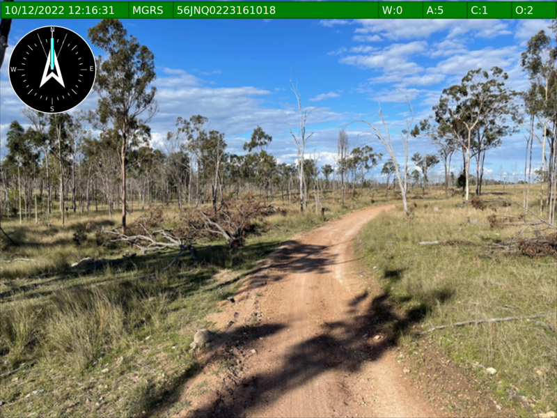
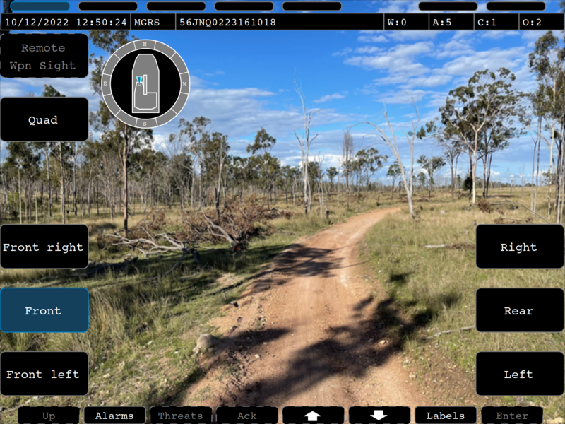

# Screenshots
## hmi-display

 
**SA Screen (Minimised)**

 
**SYS Screen (With Labels)**

 
**SA Screen right camera (With Labels)**

 
**SA Screen rear camera (With Labels)**

 
**Alarms Screen**

 
**Keyboard example with Alarms**

 
**BMS Screen (offline maps © OpenStreetMap contributor rendered with OSMScout)**

 
**Theme high contrast (SA) (user defined with different PPI)**

 
**Theme high contrast, Systems (SYS) Overview**

## Hardware
### RD-104 HD

 
**Leonardo rugged display with Core i7 CPU built in.**

 
**GVA display with NMEA and Camera source**

## gva-tool
 
**GVA test tool**
