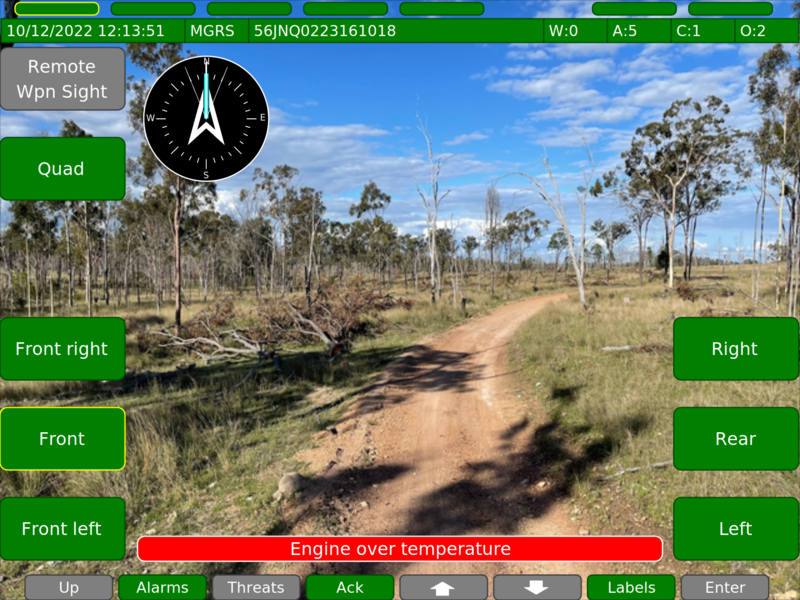

# Screenshots
## hmi-display

 
**SYS Screen (Minimised)**

 
**SYS Screen front camera (With Labels)**

 
**SYS Screen right camera (With Labels)**

 
**BMS Screen (offline maps © OpenStreetMap contributor rendered with OSMScout)**

 
**Alarms Screen**

 
**Keyboard example with Alarms**

 
**Theme high contrast (user defined)**

## Hardware
### RD-104 HD
Leonardo rugged display with Core i7 CPU built in.
 

 
## gva-tool
 
**GVA test tool**
